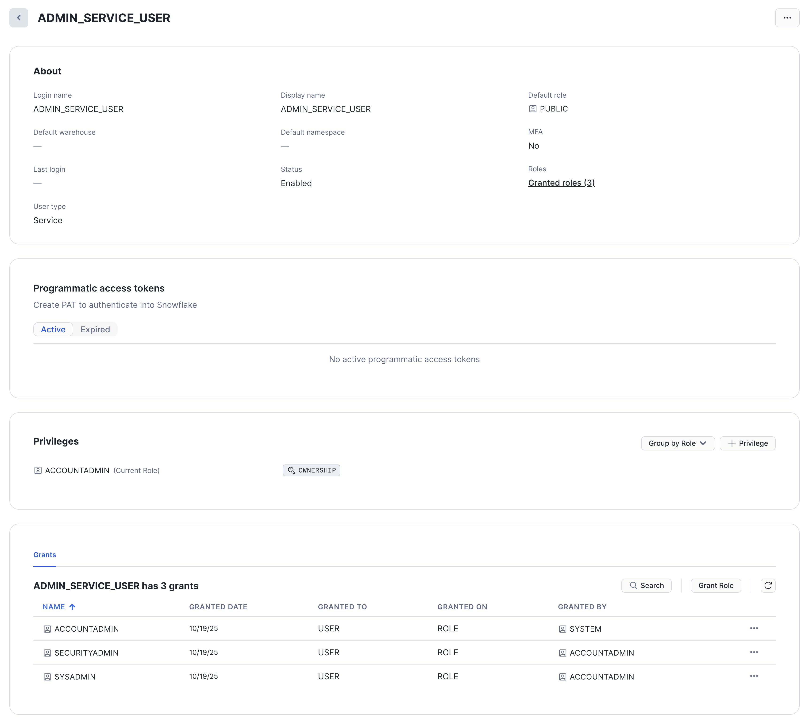
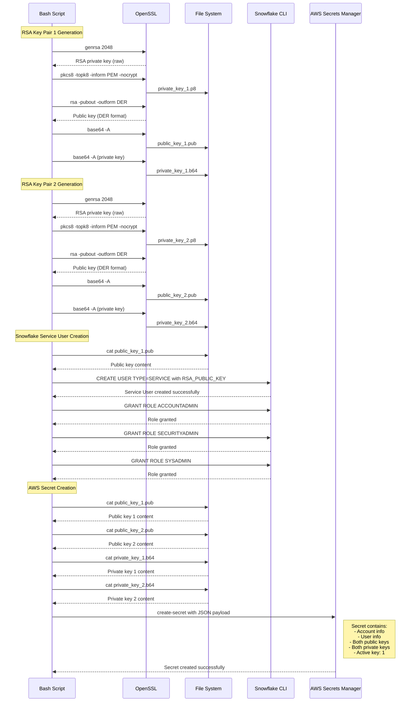

# IaC Snowflake Admin Service User RSA Key Credentials Creation Script
This script automates the creation of a Snowflake admin service user secured with RSA key-pair authentication. Designed for enterprise environments, it standardizes and accelerates the onboarding of Snowflake service users while maintaining strict security and compliance controls.

**Table of Contents**

<!-- toc -->
+ [**1.0 Let's get started!**](#10-lets-get-started)
    - [**1.1 Snowflake**](#11-snowflake)
    - [**1.2 AWS Secrets Manager Secrets**](#12-aws-secrets-manager-secrets)
+ [**2.0 Inside the Script**](#20-inside-the-script)
    - [**2.1 What it Does**](#21-what-it-does)
        - [**2.1.1 Create Mode**](#211-create-mode)
        - [**2.1.2 Delete Mode**](#212-delete-mode)
    - [**2.2 Script Sequence Diagram**](#22-script-sequence-diagram)
+ [**3.0 Resources**](#resources)
<!-- tocstop -->

## **1.0 Let's get started!**

1. Take care of the cloud and local environment prequisities listed below:
    > You need to have the following cloud accounts:
    > - [AWS Account](https://signin.aws.amazon.com/) *with SSO configured*
    > - [`aws2-wrap` utility](https://pypi.org/project/aws2-wrap/#description)
    > - [Snowflake Account](https://app.snowflake.com/)

    > You need to have the following installed on your local machine:
    > - [AWS CLI version 2](https://docs.aws.amazon.com/cli/latest/userguide/getting-started-install.html)
    > - [Snowflake CLI](https://docs.snowflake.com/en/developer-guide/snowflake-cli-v2/index)

2. Clone the repo:
    ```shell
    git clone https://github.com/j3-signalroom/iac-snowflake-admin_service_user-rsa_key_credentials_creation-script.git
    ```

3. From the root folder of the `iac-snowflake-admin_service_user-rsa_key_credentials_creation-script/` repository that you cloned, run the script in your Terminal to create the Snowflake service user:
    ```shell
    ./provision-snowflake-admin-credentials.sh <create | delete> --profile=<SSO_PROFILE_NAME> \
                                                                 --account_identifier=<ACCOUNT_IDENTIFIER> \
                                                                 --snowflake_admin_user=<SNOWFLAKE_ADMIN_USER> \
                                                                 --snowflake_password=<SNOWFLAKE_PASSWORD> \
                                                                 --snowflake_warehouse=<SNOWFLAKE_WAREHOUSE> \
                                                                 --secrets_root_path=<SECRETS_ROOT_PATH> \
                                                                 --new_admin_service_user=<NEW_ADMIN_SERVICE_USER>
    ```
    Argument placeholder|Replace with
    -|-
    `<SSO_PROFILE_NAME>`|your AWS SSO profile name for your AWS infrastructue that houses your AWS Secrets Manager.
    `<ACCOUNT_IDENTIFIER>`|your organization's [Snowflake account identifier](https://docs.snowflake.com/en/user-guide/admin-account-identifier).
    `<SNOWFLAKE_ADMIN_USER>`|your Snowflake username that has been granted `ACCOUNTADMIN` privileges.
    `<SNOWFLAKE_PASSWORD>`|your Snowflake password of the `<SNOWFLAKE_ADMIN_USER>`.
    `<SNOWFLAKE_WAREHOUSE>`|your Snowflake warehouse is the virtual cluster of compute resources that provides CPU, memory, and temporary storage to perform DML (Data Management Language) operations.
    `<SECRETS_ROOT_PATH>`|the root path in AWS Secrets Manager where the secrets will be stored.
    `<NEW_ADMIN_SERVICE_USER>`|the name of the new Snowflake ACCOUNTADMIN service user to be created or updated.

For instance, here is an example command to create a new Snowflake admin service user named `admin_service_user`:

```shell
./provision-snowflake-admin-credentials.sh create --profile=AdministratorAccess-0123987654321 \
                                                  --snowflake_account_identifier=abcdef-xyz12345 \
                                                  --snowflake_admin_user=your_admin_user \
                                                  --snowflake_password=your_admin_password \
                                                  --snowflake_warehouse=COMPUTE_WH \
                                                  --secrets_root_path=/snowflake_admin_service_user_credentials \
                                                  --new_admin_service_user=admin_service_user
```

The output of the script running successfully:
```shell
Attempting to automatically open the SSO authorization page in your default browser.
If the browser does not open or you wish to use a different device to authorize this request, open the following URL:

https://your-organization.awsapps.com/start/#/device

Then enter the code:

WXYZ-ABCD
Successfully logged into Start URL: https://your-organization.awsapps.com/start
writing RSA key
writing RSA key
CREATE USER admin_service_user TYPE=SERVICE RSA_PUBLIC_KEY="MIIBIjANBgkqhkiG9w0BAQEFAAOCAQ8AMIIBCgKCAQEApVfuwgFR6bD0qIj+Em2E6asyvZ66I0BgHG6uxgzQzy0NxGVXSguXDWdQGyAWce4WGD8ZKG4g1UFgY+swF1jqHXpWQqHd1mG99XigUSFhr0iF8cD7eA797GAygPyWywfYeK2aRduedqh9+DGtVF8jfeT+KCV6GQWZqFv1nChJY+o1rDpF14PhmVVwyEpNrmiJ3WUIeQo7m1gRL1ZlNKaucahuHIOoJUaKlC0xYY3AkHgZecN24d/HF5TN0TX4rb6fXUQgbkj1ga3WxsaEoyq8mU4DwrLo/Eqhngx9Dq3GQUU8cxvZrwJm6XRn5WgFRpWafDBnBJuP8xDHTG5oN9bbywIDAQAB" DEFAULT_ROLE=PUBLIC;
+-----------------------------------------------+
| status                                        |
|-----------------------------------------------|
| User ADMIN_SERVICE_USER successfully created. |
+-----------------------------------------------+

GRANT ROLE ACCOUNTADMIN TO USER admin_service_user;
+----------------------------------+
| status                           |
|----------------------------------|
| Statement executed successfully. |
+----------------------------------+

GRANT ROLE SECURITYADMIN TO USER admin_service_user;
+----------------------------------+
| status                           |
|----------------------------------|
| Statement executed successfully. |
+----------------------------------+

GRANT ROLE SYSADMIN TO USER admin_service_user;
+----------------------------------+
| status                           |
|----------------------------------|
| Statement executed successfully. |
+----------------------------------+

{
    "ARN": "arn:aws:secretsmanager:us-east-1:0123987654321:secret:/snowflake_admin_service_user_credentials-0zVHcy",
    "Name": "/snowflake_admin_service_user_credentials",
    "VersionId": "645f7f6c-e8ef-4fba-b0c6-7ece065abdfd"
}
```

### **1.1 Snowflake**
Below is a picture of an example Snowflake admin service user created with the `ACCOUNTADMIN` role granted by the script:



### **1.2 AWS Secrets Manager Secrets**
Here is the list of secret keys generated by the script:

> Key|Description
> -|-
> `snowflake_account_identifier`|Your organization's [Snowflake account identifier](https://docs.snowflake.com/en/user-guide/admin-account-identifier).
> `snowflake_organization_name`|The name of your Snowflake organization, which is the part of the account identifier before the hyphen.
> `snowflake_account_name`|The name of your Snowflake account, which is the part of the account identifier after the hyphen.
> `new_admin_service_user`|The name of the new Snowflake admin user to create and manage future Snowflake resources.
> `active_key_number`|The current active RSA public key number.
> `snowflake_rsa_public_key_1_pem`|The `new_admin_service_user` Snowflake RSA Public Key 1 PEM, which is encoded in **base64**.
> `snowflake_rsa_public_key_2_pem`|The `new_admin_service_user` Snowflake RSA Public Key 2 PEM, which is encoded in **base64**.
> `snowflake_rsa_private_key_1_pem`|The `new_admin_service_user` Snowflake RSA Private Key 1 PEM, which is encoded in **base64**.
> `snowflake_rsa_private_key_2_pem`|The `new_admin_service_user` Snowflake RSA Private Key 2 PEM, which is encoded in **base64**.

## **2.0 Inside the Script**
This bash script provisions or removes Snowflake admin credentials by creating a service account with RSA key-pair authentication and storing the credentials in AWS Secrets Manager:

### **2.1 What it Does**

#### **2.1.1 Create Mode**
When run in `create` mode, the script performs the following actions:

1. Generates two RSA key pairs (2048-bit) for Snowflake authentication, converting them to the required formats (PKCS8 private keys and base64-encoded public keys)

2. Creates a Snowflake service user with:
- The first public key for authentication

- `ACCOUNTADMIN`, `SECURITYADMIN`, and `SYSADMIN` role grants:
    Role|Description
    -|-
    `ACCOUNTADMIN`|The `ACCOUNTADMIN` role in Snowflake is the highest-level administrative role within a Snowflake account. It has full control over all objects, resources, and configurations within the account. This role is responsible for managing all aspects of the Snowflake environment, including user access, resource allocation, and security settings.
    `SECURITYADMIN`|The `SECURITYADMIN` role in Snowflake is a built-in system role designed to manage security-related tasks, primarily concerning user and role management. The `SECURITYADMIN` role has elevated privileges that allow it to control access within a Snowflake account, making it one of the key roles for maintaining the security posture of a Snowflake environment.
    `SYSADMIN`|The `SYSADMIN` role in Snowflake is one of the predefined system roles that comes with a broad set of administrative privileges. It is designed to provide comprehensive control over most Snowflake resources, such as databases, schemas, warehouses, and other objects within an account. The `SYSADMIN` role is typically used for database administrators who manage the creation and configuration of Snowflake resources and control access to them.

- `SERVICE` account type designation.

3. Stores credentials in AWS Secrets Manager including:
- Snowflake account identifiers (full identifier, organization name, account name)
- Service username
- Both RSA key pairs (public and private)
- Active key indicator (for key rotation)

4. Cleans up temporary key files from disk

#### **2.1.2 Delete Mode**
When run in `delete` mode, the script performs the following actions:
1. Removes the Snowflake service user created in `create` mode.
2. Deletes the associated RSA key pairs from the file system.
3. Removes the credentials stored in AWS Secrets Manager.

### **2.2 Script Sequence Diagram**


## **3.0 Resources**
- [Snowflake Configuring key-pair authentication](https://docs.snowflake.com/en/user-guide/key-pair-auth#configuring-key-pair-authentication)
- [Supported Snowflake Clients](https://docs.snowflake.com/en/user-guide/key-pair-auth#supported-snowflake-clients)
