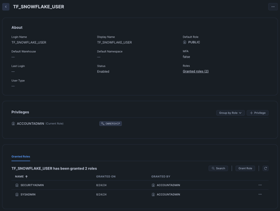

# IaC Snowflake User Create with RSA key pair authentication

**Enhancing Efficiency and Security with Automated Snowflake User Management**

J3 has developed a script to dramatically improve both the efficiency and security of operations at signalRoom.  This script focuses on simplifying the process of creating Snowflake users who utilize key pair authentication, which is crucial for secure access management.

### Key Features and Benefits:

1. **Automated RSA Key Pair Generation:**
   - The script automates the creation of RSA key pairs, which are essential for authenticating Snowflake users.  By handling this automatically, the script eliminates manual steps, making it easier for developers to integrate and manage Snowflake resources through Terraform or other Snowflake clients.
   - This automation streamlines the authentication process, reducing setup time and potential errors, thereby enabling faster and more reliable deployment of Snowflake services.

2. **Secure Storage in AWS Secrets Manager:**
   - User information and RSA key pairs are securely stored in AWS Secrets Manager.  This ensures that sensitive data is protected while remaining easily accessible for future use without needing to compromise security.
   - The integration with AWS Secrets Manager supports secure key management practices, safeguarding against unauthorized access and simplifying the retrieval of credentials when needed.

3. **Support for Key-Pair Rotation:**
   - To adhere to best practices in security, the script creates two RSA key pairs for each Snowflake user. This approach supports seamless key rotation, allowing one key to be replaced while the other remains active.
   - The decision to generate only two key pairs aligns with Snowflake's current limitation, which allows associating a maximum of two RSA public keys per user.  This ensures compliance with Snowflake's capabilities while maintaining robust security protocols.

### Motivation and Broader Impact:

- **Streamlined Service Account Creation:**
   - The primary motivation behind this script is to streamline the entire process of creating service accounts. By bundling all necessary steps into one comprehensive solution, one doesn't have to put all the puzzle pieces together alone; it is already done for you (e.g., creating the RSA key pair, creating the snowflake user, and granting the roles).
   - This approach not only enhances security by reducing credential exposure but also reflects a commitment to delivering efficient, all-in-one solutions for managing cloud resources.

### Commitment to Excellence and Security:

- **Innovative and Secure Solutions:**
   - This script embodies a dedication to excellence and continuous improvement, aiming to find more effective ways to manage cloud infrastructure.  By focusing on automation and secure key management, J3 is contributing to a more secure, efficient, and scalable environment at signalRoom.

**Table of Contents**

<!-- toc -->
+ [1.0 Let's get started!](#10-lets-get-started)
    - [1.1 Snowflake](#11-snowflake)
    - [1.2 AWS Secrets Manager Secrets](#12-aws-secrets-manager-secrets)
        + [1.2.1 `/snowflake_resource`](#121-snowflake_resource)
        + [1.2.2 `/snowflake_resource/rsa_private_key_pem_1`](#122-snowflake_resourcersa_private_key_pem_1)
        + [1.2.3 `/snowflake_resource/rsa_private_key_pem_2`](#123-snowflake_resourcersa_private_key_pem_2)
<!-- tocstop -->

## 1.0 Let's get started!

1. Take care of the cloud and local environment prequisities listed below:
    > You need to have the following cloud accounts:
    > - [AWS Account](https://signin.aws.amazon.com/) *with SSO configured*
    > - [`aws2-wrap` utility](https://pypi.org/project/aws2-wrap/#description)
    > - [Snowflake Account](https://app.snowflake.com/)

    > You need to have the following installed on your local machine:
    > - [AWS CLI version 2](https://docs.aws.amazon.com/cli/latest/userguide/getting-started-install.html)
    > - [Snowflake CLI](https://docs.snowflake.com/en/developer-guide/snowflake-cli-v2/index)

2. Clone the repo:
    ```shell
    git clone https://github.com/j3-signalroom/iac-snowflake-user-create_with_key_pair_authentication.git
    ```

3. From the root folder of the `iac-snowflake-user-create_with_key_pair_authentication/` repository that you cloned, run the script in your Terminal to create the Snowflake user:
    ```shell
    ./create-service-account-user.sh <create | delete> --profile=<SSO_PROFILE_NAME> \
                                                       --snowflake_account=<SNOWFLAKE_ACCOUNT> \
                                                       --snowflake_user=<SNOWFLAKE_USER> \
                                                       --snowflake_password=<SNOWFLAKE_PASSWORD> \
                                                       --snowflake_warehouse=<SNOWFLAKE_WAREHOUSE> \
                                                       --service_account_user=<SERVICE_ACCOUNT_USER>
    ```
    Argument placeholder|Replace with
    -|-
    `<SSO_PROFILE_NAME>`|your AWS SSO profile name for your AWS infrastructue that houses your AWS Secrets Manager.
    `<SNOWFLAKE_ACCOUNT>`|your organization's [Snowflake account identifier](https://docs.snowflake.com/en/user-guide/admin-account-identifier).
    `<SNOWFLAKE_USER>`|your Snowflake username that has been granted `ACCOUNTADMIN` privileges.
    `<SNOWFLAKE_PASSWORD>`|your Snowflake password of the `<SNOWFLAKE_USER>`.
    `<SNOWFLAKE_WAREHOUSE>`|your Snowflake warehouse is the virtual cluster of compute resources that provides CPU, memory, and temporary storage to perform DML (Data Management Language) operations.
    `<SERVICE_ACCOUNT_USER>`|the name of the Snowflake service account user to be created or updated.


After the script successfully runs it creates the following in Snowflake and the AWS Secrets Manager for you:

### 1.1 Snowflake
Below is a picture of an example Terraform Snowflake service account user created with the `SYSADMIN` and `SECURITYADMIN` roles granted by the script:


### 1.2 AWS Secrets Manager Secrets
Here is the list of secrets generated by the Terraform script:

#### 1.2.1 `/snowflake_resource`
> Key|Description
> -|-
> `account`|your organization's [Snowflake account identifier](https://docs.snowflake.com/en/user-guide/admin-account-identifier).
> `user`|the Snowflake service account user associated with the RSA key pairs.
> `rsa_public_key_1`|the `user` RSA public key.
> `rsa_public_key_2`|the `user` RSA public key.

#### 1.2.2 `/snowflake_resource/rsa_private_key_pem_1`
The `user` RSA private key PEM 1.

#### 1.2.3 `/snowflake_resource/rsa_private_key_pem_2`
The `user` RSA private key PEM 2.