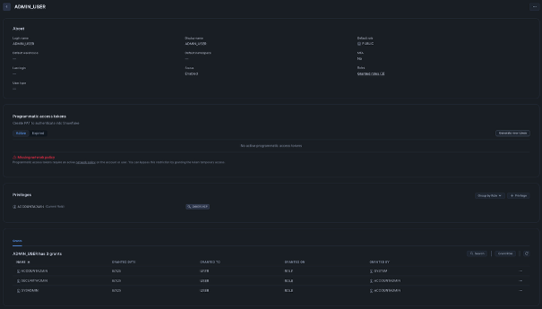
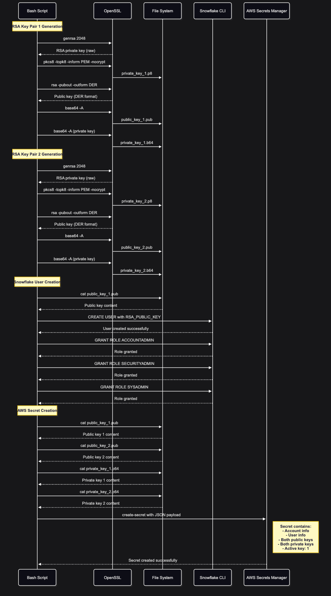

# IaC Snowflake Admin User RSA Key Credentials Creation Script
This script greatly enhances the efficiency and security of an enterprise's operations. It aims to simplify the process of creating Snowflake admin users who use RSA key pair authentication. These admin users will eventually be responsible for creating Snowflake User or Service Accounts.  **Especially since as of November 2025, Snowflake announced in 2024 that it will [block single-factor password authentication](https://www.snowflake.com/en/blog/blocking-single-factor-password-authentification/) for user and service accounts!**


So, I am glad you are reading this!  😉  Below is a list of the key benefits of this script:

1. **Automated RSA Key Pair Generation:**
   - The script automates the creation of RSA key pairs, which are essential for authenticating the Snowflake user.  By handling this automatically, the script eliminates manual steps, making it easier for developers to integrate and manage Snowflake resources through Terraform or other Snowflake clients.
   - This automation streamlines the authentication process, reducing setup time and potential errors, thereby enabling faster and more reliable deployment of Snowflake services.

2. **Minimal required permissions:**
   - The script grants the smallest set of privileges that the admin user needs to perform its required actions. This approach is part of the principle of *least privilege*, a security best practice that minimizes the potential for unauthorized access or accidental modifications by limiting permissions to only what is necessary.  Below is the list of roles that will be granted to the admin user:

      Role|Description
      -|-
      `ACCOUNTADMIN`|The `ACCOUNTADMIN` role in Snowflake is the highest-level administrative role within a Snowflake account. It has full control over all objects, resources, and configurations within the account. This role is responsible for managing all aspects of the Snowflake environment, including user access, resource allocation, and security settings.
      `SECURITYADMIN`|The `SECURITYADMIN` role in Snowflake is a built-in system role designed to manage security-related tasks, primarily concerning user and role management. The `SECURITYADMIN` role has elevated privileges that allow it to control access within a Snowflake account, making it one of the key roles for maintaining the security posture of a Snowflake environment.
      `SYSADMIN`|The `SYSADMIN` role in Snowflake is one of the predefined system roles that comes with a broad set of administrative privileges. It is designed to provide comprehensive control over most Snowflake resources, such as databases, schemas, warehouses, and other objects within an account. The `SYSADMIN` role is typically used for database administrators who manage the creation and configuration of Snowflake resources and control access to them.

3. **Secure Storage in AWS Secrets Manager:**
   - User information and RSA key pairs are securely stored in AWS Secrets Manager.  This ensures that sensitive data is protected while remaining easily accessible for future use without needing to compromise security.
   - The integration with AWS Secrets Manager supports secure key management practices, safeguarding against unauthorized access and simplifying the retrieval of credentials when needed.

4. **Support for Key-Pair Rotation:**
   - To adhere to best practices in security, the script creates two RSA key pairs for each Snowflake user. This approach supports seamless key rotation, allowing one key to be replaced while the other remains active.
   - The decision to generate only two key pairs aligns with Snowflake's current limitation, which allows associating a maximum of two RSA public keys per user.  This ensures compliance with Snowflake's capabilities while maintaining robust security protocols.

5. **Support for all the Snowflake clients:**
   - Click [here](https://docs.snowflake.com/en/user-guide/key-pair-auth#supported-snowflake-clients) for a list of supported Snowflake clients.

**Table of Contents**

<!-- toc -->
+ [**1.0 Let's get started!**](#10-lets-get-started)
    - [**1.1 Snowflake**](#11-snowflake)
    - [**1.2 AWS Secrets Manager Secrets**](#12-aws-secrets-manager-secrets)
+ [**2.0 Summary**](#20-summary)
+ [**Resources**](#resources)
<!-- tocstop -->

## 1.0 Let's get started!

1. Take care of the cloud and local environment prequisities listed below:
    > You need to have the following cloud accounts:
    > - [AWS Account](https://signin.aws.amazon.com/) *with SSO configured*
    > - [`aws2-wrap` utility](https://pypi.org/project/aws2-wrap/#description)
    > - [Snowflake Account](https://app.snowflake.com/)

    > You need to have the following installed on your local machine:
    > - [AWS CLI version 2](https://docs.aws.amazon.com/cli/latest/userguide/getting-started-install.html)
    > - [Snowflake CLI](https://docs.snowflake.com/en/developer-guide/snowflake-cli-v2/index)

2. Clone the repo:
    ```shell
    git clone https://github.com/j3-signalroom/snowflake_admin_user_rsa_key_credentials_creation_script.git
    ```

3. From the root folder of the `snowflake_admin_user_rsa_key_credentials_creation_script/` repository that you cloned, run the script in your Terminal to create the Snowflake user:
    ```shell
    ./create-store-snowflake-admin-user-credentials.sh <create | delete> --profile=<SSO_PROFILE_NAME> \
                                                                         --account_identifier=<ACCOUNT_IDENTIFIER> \
                                                                         --snowflake_user=<SNOWFLAKE_USER> \
                                                                         --snowflake_password=<SNOWFLAKE_PASSWORD> \
                                                                         --snowflake_warehouse=<SNOWFLAKE_WAREHOUSE> \
                                                                         --secrets_root_path=<SECRETS_ROOT_PATH> \
                                                                         --new_admin_user=<NEW_ADMIN_USER>
    ```
    Argument placeholder|Replace with
    -|-
    `<SSO_PROFILE_NAME>`|your AWS SSO profile name for your AWS infrastructue that houses your AWS Secrets Manager.
    `<ACCOUNT_IDENTIFIER>`|your organization's [Snowflake account identifier](https://docs.snowflake.com/en/user-guide/admin-account-identifier).
    `<SNOWFLAKE_USER>`|your Snowflake username that has been granted `ACCOUNTADMIN` privileges.
    `<SNOWFLAKE_PASSWORD>`|your Snowflake password of the `<SNOWFLAKE_USER>`.
    `<SNOWFLAKE_WAREHOUSE>`|your Snowflake warehouse is the virtual cluster of compute resources that provides CPU, memory, and temporary storage to perform DML (Data Management Language) operations.
    `<SECRETS_ROOT_PATH>`|the root path in AWS Secrets Manager where the secrets will be stored.
    `<NEW_ADMIN_USER>`|the name of the new Snowflake ACCOUNTADMIN user to be created or updated.


After the script successfully runs it creates the following in Snowflake and the AWS Secrets Manager for you:

### 1.1 Snowflake
Below is a picture of an example Snowflake admin user created with the `ACCOUNTADMIN` role granted by the script:



### 1.2 AWS Secrets Manager Secrets
Here is the list of secrets generated by the Terraform script:

> Key|Description
> -|-
> `snowflake_account_identifier`|Your organization's [Snowflake account identifier](https://docs.snowflake.com/en/user-guide/admin-account-identifier).
> `snowflake_organization_name`|The name of your Snowflake organization, which is the part of the account identifier before the hyphen.
> `snowflake_account_name`|The name of your Snowflake account, which is the part of the account identifier after the hyphen.
> `new_admin_user`|The name of the new Snowflake admin user to create and manage future Snowflake resources.
> `active_key_number`|The current active RSA public key number.
> `snowflake_rsa_public_key_1_pem`|The `new_admin_user` Snowflake RSA Public Key 1 PEM, which is encoded in **base64**.
> `snowflake_rsa_public_key_2_pem`|The `new_admin_user` Snowflake RSA Public Key 2 PEM, which is encoded in **base64**.
> `snowflake_rsa_private_key_1_pem`|The `new_admin_user` Snowflake RSA Private Key 1 PEM, which is encoded in **base64**.
> `snowflake_rsa_private_key_2_pem`|The `new_admin_user` Snowflake RSA Private Key 2 PEM, which is encoded in **base64**.

## 2.0 Summary 
This script automates the creation of Snowflake admin users with RSA key pair authentication. It generates two RSA key pairs for each user, ensuring a secure and efficient authentication method. The script also manages the storage of these keys in AWS Secrets Manager, making it easier to handle sensitive information.  Below is a sequential diagram of the workflow:



## Resources
- [Snowflake Configuring key-pair authentication](https://docs.snowflake.com/en/user-guide/key-pair-auth#configuring-key-pair-authentication)
